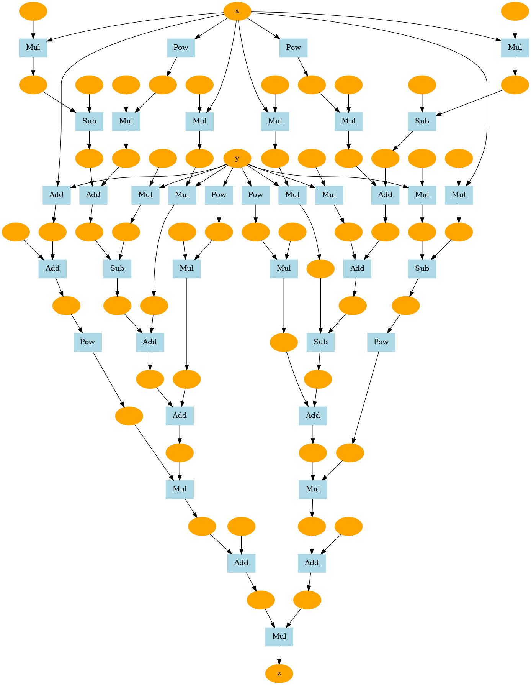

# DeZero-julia

「ゼロから作るDeep Learning ❸」をjuliaで実装しながら勉強する。

## メモ
- step02 : `Function`はjuliaで使われているので、`Func`型と命名
- step02 : `Func`の構造を本と違ったものにした。
- step09 : `Func`の実装方法を変更。本の実装に戻す。
- step11 : `FuncBase`を追加。
- step22 : `FuncBase`を削除。`Func`生成をマクロ化。
- ./src/core.jlの大幅変更により、初期のstepのプログラムが動かないことに気づく。

## pictures

